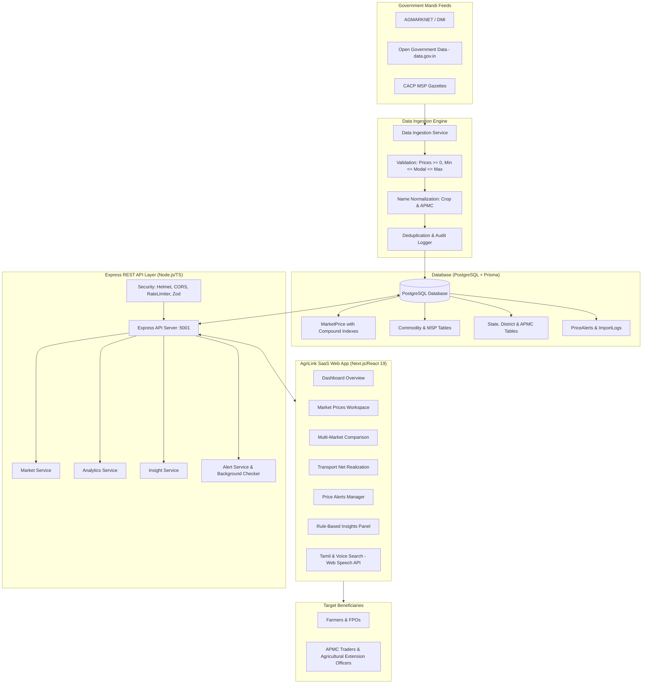
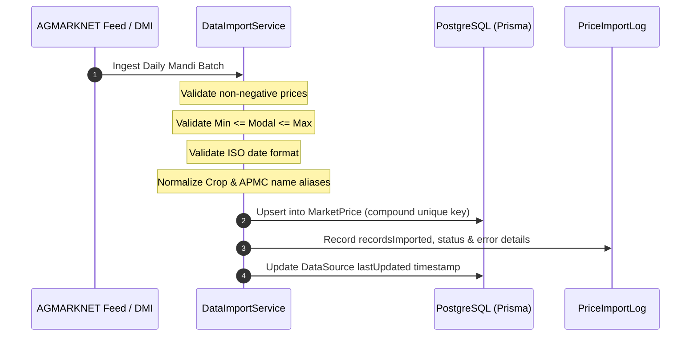
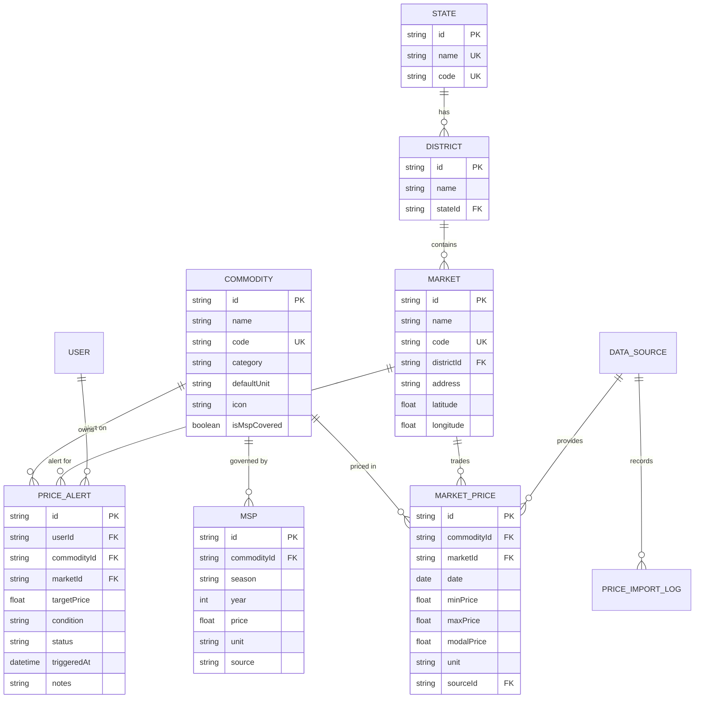
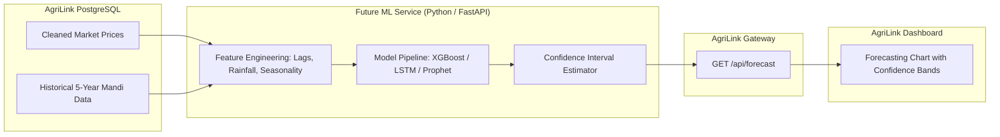

# AgriLink — System Architecture & Technical Specifications

> **Project:** AgriLink — Market Intelligence for a Stronger Tomorrow  
> **Team:** Alpha Nexus  
> **Institution:** Panimalar Engineering College  
> **Core Principle:** Production-quality agricultural market intelligence based on verified government mandi records and deterministic, transparent business rules.

---

## 1. High-Level System Architecture

AgriLink is architected with a decoupled frontend and backend service structure. The user interface does not directly touch the database; all data flows securely through a validated REST API layer.

---

## 2. Data Ingestion Architecture & Provenance

The system enforces strict data verification before writing to PostgreSQL:

### Ingestion Validation Rules:
1. **Price Positivity**: `price >= 0`
2. **Order Consistency**: `minPrice <= modalPrice <= maxPrice` (auto-sorts inverted trader inputs).
3. **Strict Date Parsing**: Format must match `YYYY-MM-DD`.
4. **Duplicate Protection**: Compound unique constraint `[commodityId, marketId, date]`.

---

## 3. Database Entity Relationship Model (ERD)

---

## 4. Deterministic Analytics Engine Specifications

AgriLink deliberately avoids black-box AI guessing for market prices, relying instead on reproducible mathematical formulations:

### 1. Historical Trend Calculation
$$\text{Percentage Change} = \left(\frac{\text{Latest Price} - \text{First Price}}{\text{First Price}}\right) \times 100$$
- $\text{Change} \ge +1.5\% \implies \mathbf{UP}$ (Upward Trend)
- $\text{Change} \le -1.5\% \implies \mathbf{DOWN}$ (Softening Trend)
- $-1.5\% < \text{Change} < +1.5\% \implies \mathbf{STABLE}$ (Consolidation)

### 2. Price Position Percentile
$$\text{Percentile Rank} = \left(\frac{C_{\text{below}} + 0.5 \times C_{\text{equal}}}{N}\right) \times 100$$
- $\text{Percentile} \ge 66.6\% \implies \mathbf{UPPER\_RANGE}$
- $33.3\% \le \text{Percentile} < 66.6\% \implies \mathbf{MIDDLE\_RANGE}$
- $\text{Percentile} < 33.3\% \implies \mathbf{LOWER\_RANGE}$

### 3. Volatility Index (Coefficient of Variation)
$$CV = \left(\frac{\sigma}{\mu}\right) \times 100$$
- $CV < 8\% \implies \mathbf{LOW}$ (Steady Trading)
- $8\% \le CV \le 18\% \implies \mathbf{MEDIUM}$ (Moderate Fluctuation)
- $CV > 18\% \implies \mathbf{HIGH}$ (Rapid Price Swings)

### 4. Net Farmer Realization (Transport Calculator)
$$\text{Gross Market Value} = \text{Market Price} \times \text{Quantity (kg)}$$
$$\text{Total Transport Cost} = \text{Distance (km)} \times \text{Transport Rate (₹/km)}$$
$$\text{Net Realization} = \max(0, \text{Gross Market Value} - \text{Total Transport Cost})$$
$$\text{Net Realization per kg} = \frac{\text{Net Realization}}{\text{Quantity (kg)}}$$

---

## 5. Security & Reliability

- **Helmet**: Secures HTTP response headers against clickjacking, sniffing, and cross-site injection.
- **CORS**: Strict origin whitelist matching client port and local host.
- **Rate Limiting**: `express-rate-limit` prevents API brute-forcing (200 requests / 15 mins).
- **Zod Validation**: Strong runtime schema validation on all query parameters and request bodies.
- **Mock Fallback**: Frontend automatically switches to offline demo data if backend connection drops, with a visible "Demo Data" badge.

---

## 6. Future Machine Learning Forecasting Architecture

While the current system uses deterministic government data, the architecture is designed to support downstream ML forecasting services without altering the core database or client applications:

